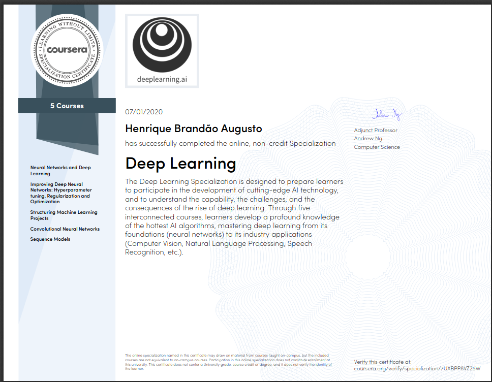

# [Deep Learning Specialization](https://www.coursera.org/specializations/deep-learning?) @ Coursera

### Feel free to read. I hope it helps you on YOUR OWN work.

### Despite the MIT License, remember Coursera's [Honor Code](https://learner.coursera.help/hc/en-us/articles/209818863-Coursera-Honor-Code) and [Code of Conduct](https://learner.coursera.help/hc/en-us/articles/208280036-Coursera-Code-of-Conduct)!

## Content

- Course 1: Neural Networks and Deep Learning
- Course 2: Improving Deep Neural Networks: Hyperparameter tuning, Regularization and Optimization
- Course 3: Structuring Machine Learning Projects
- Course 4: Convolutional Neural Networks
- Course 5: Sequence Models

## Bonus readings
- [Creating Virtual Environments](https://docs.python.org/3/tutorial/venv.html)
- [PEP 8 -- Style Guide for Python Code](https://www.python.org/dev/peps/pep-0008/#introduction)
- [Calculate mini-batch memory impact](https://datascience.stackexchange.com/questions/12649/how-to-calculate-the-mini-batch-memory-impact-when-training-deep-learning-models)
- [Kaggle: Data Leakage](https://www.kaggle.com/alexisbcook/data-leakage)
- [Simple explanation about back propagation](http://cs231n.github.io/optimization-2/)
- [Memory usage and computational considerations](http://imatge-upc.github.io/telecombcn-2016-dlcv/slides/D2L1-memory.pdf)
- YouTube: [Memory Usage and Computational Considerations (by Kevin Mc Guinness)](https://www.youtube.com/watch?v=Hqtg7fznlnM)
- [Neural networks made easy](https://techcrunch.com/2017/04/13/neural-networks-made-easy/)
- NVIDIA - Deep Learning in a Nutshell:
	- Part 1 - [Core Concepts](https://devblogs.nvidia.com/deep-learning-nutshell-core-concepts/)
	- Part 2 - [History and Training](https://devblogs.nvidia.com/deep-learning-nutshell-history-training/)
- Part 3 - [Sequence Learning](https://devblogs.nvidia.com/deep-learning-nutshell-sequence-learning/)
	- Part 4 - [Reinforcement Learning](https://devblogs.nvidia.com/deep-learning-nutshell-reinforcement-learning/)
- [MIT Press - Deep Learning Book](http://www.deeplearningbook.org/)
- [Convolutions and Backpropagations](https://medium.com/@pavisj/convolutions-and-backpropagations-46026a8f5d2c)
- [How to structure a pytorch ml project with google colab and tensorboard](https://hackernoon.com/how-to-structure-a-pytorch-ml-project-with-google-colab-and-tensorboard-7ram3agi)
- [CS231n: Convolutional Neural Networks for Visual Recognition](https://github.com/cs231n/cs231n.github.io):
	- [neural networks 1](https://github.com/cs231n/cs231n.github.io/blob/master/neural-networks-1.md)
	- [neural networks 2](https://github.com/cs231n/cs231n.github.io/blob/master/neural-networks-2.md)
	- [neural networks 3](https://github.com/cs231n/cs231n.github.io/blob/master/neural-networks-3.md)
	- [optimization 1](https://github.com/cs231n/cs231n.github.io/blob/master/optimization-1.md)
	- [optimization 2](https://github.com/cs231n/cs231n.github.io/blob/master/optimization-2.md)
- [Random search for hyperparameter optimization](http://www.jmlr.org/papers/volume13/bergstra12a/bergstra12a.pdf)
- [Multilabel classification](https://mc.ai/how-to-perform-multilabel-classification-using-deep-learning/)
- [Tensorflow - Word embeddings](https://www.tensorflow.org/tutorials/text/word_embeddings)
- [Efficient Estimation of Word Representations inVector Space](https://arxiv.org/pdf/1301.3781.pdf)
- [The Illustrated Word2vec](http://jalammar.github.io/illustrated-word2vec/)
- [A Beginner's Guide to Word2Vec and Neural Word Embeddings](https://pathmind.com/wiki/word2vec)
- [Fourier Transform](https://en.wikipedia.org/wiki/Fourier_transform)

##### Enjoy! &#8718;
